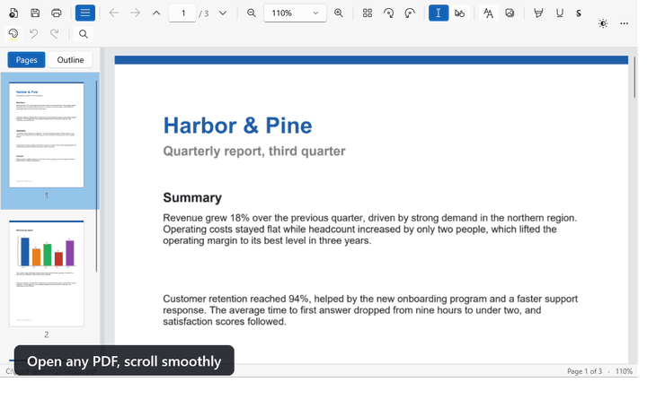

# pPdf

A small, fast PDF reader for Windows (.NET 10, WPF), with light and dark theme: search, text selection, highlights, text and image annotations, fillable forms, printing, and it reopens every document where you left it.

[](https://github.com/FirekeeperPhate/pPdf/releases/latest)




## Download

Get the installer from the **[latest release](https://github.com/FirekeeperPhate/pPdf/releases/latest)**:

- `pPdf-Setup-<version>-Full.exe` (about 45 MB): everything included, nothing else to install.
- `pPdf-Setup-<version>-Light.exe` (about 5 MB): needs the [.NET 10 Desktop Runtime](https://dotnet.microsoft.com/download/dotnet/10.0).

Installs for the current user by default (an all-users install is offered too). pPdf never makes itself the default PDF app (it only adds itself to "Open with"), and once installed it updates itself.

## Features

- **Viewing**: reopens each document exactly where you left it (page, point in the page, zoom, rotation); continuous, single page, two pages, two pages continuous; fit width / fit page / any zoom (Ctrl+wheel); rotation; thumbnails and outline panel; clickable links; optional inverted page colors for night reading.
- **Text**: the pointer is an I-beam over text and an open hand elsewhere (drag the empty page to scroll); select (drag, double-click word, triple-click line, Ctrl+A) and copy; find across the whole document (accent/case-insensitive, match case, whole words) with highlighted hits.
- **Annotations**: keyboard text boxes (font, size, bold/italic, color, fill), images (transparent PNG supported) that can be moved and resized, and highlight / underline / strike-through of selected text; paste or drop images; undo/redo. They are kept automatically for each document and come back, still editable, when it is opened again.
- **Forms**: fillable AcroForm fields (text, check boxes, radio buttons, choices) can be filled in, kept, saved into a copy, printed and exported.
  *Save a copy* (Ctrl+S) writes them into the PDF pages (they become part of the page content); the original file is never touched.
- **Printing**: page range, pages fitted to the sheet (landscape pages turn), annotations included.
- **Updates**: checks GitHub for a newer release once a day (More menu: Check for updates, or switch the automatic check off), downloads the installer of the same edition, verifies size and SHA-256, closes, installs and reopens the same file. Nothing is installed without asking. While the repository is private there is nothing to find, and the check says so.

Light by design: one process for all windows, a render cache sized on the screen, caches released when minimized, big files read on demand, no polling (0 % CPU at rest).

Rendering and text extraction: PDFium (PDFiumCore). Writing annotations: PDFsharp.

## Build

```
dotnet build -c Release
dotnet test
```

Settings live in `%AppData%\pPdf\settings.json` (`PPDF_DATA_DIR` overrides the folder). `tools/DrawIcon.cs` regenerates the icon.
